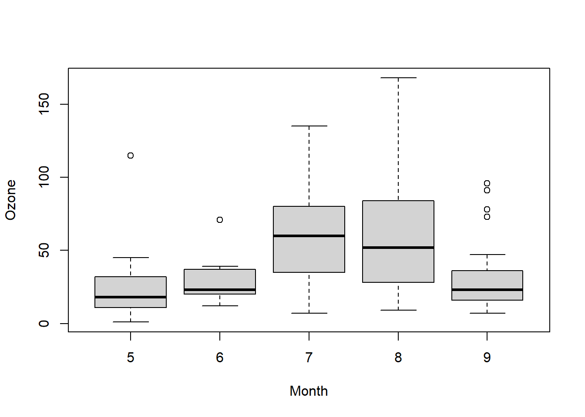

------------------------------------------------------------------------

# 统计描述

首先了解数据的频数分布，选用合适的集中以及离散趋势描述数据。

## 数值变量

频数分布图形： range / n 取整数。

-   正态分布数据选用算术均值，方差/标准差/变异系数描述其分布。

    理论公式：\
    计算公式：

> 标准差，变异系数是同单位的。变异系数用于不同尺度，均值相差较大的数据。 方差/标准差/变异系数的计算都依赖于均值的计算。

-   对数正态分布数据选用几何均值，全距/四分位数。

    理论公式：\
    计算公式：

-   任意其它分布选用中位数，全距/四分位数

## 分类变量

分类变量数据主要依赖于各种相对数描述，包括proportion, rate, ration.其中rate主要涉及到时间的概念。

> 数据的标准化法 直接化法，按总人口统一人口数。 间接法， 每组死亡人数与预期死亡人数之比互相比较。
>
> 动态数列 定基/环比，变化/增长（-1），平均发展速度，平均变化速度。

# 正态总体均值的置信区间以及假设检验

::: {#thm-normal-populaton-sample-mean-distribution}
## normal populaton's sample mean following a normal distribution

设$X_1, X_2, ..., X_n$是来自正态总体$N(\mu, \sigma^2)$的样本，$\bar{X}$是样本均值，则有：

$$
\bar{X} \sim N(\mu, \sigma^2/n).
$$ 
:::

::: {#thm-normal-populaton-sample-variance-distribution}
## normal populaton's sample variance following scaling $\chi^2$ distribution

设$X_1, X_2, ..., X_n$是来自正态总体$N(\mu, \sigma^2)$的样本， $\bar{X}, S^2$分别是样本均值和样本方差，则有

1.  $$
    \frac{(n-1)S^2}{\sigma^2} \sim \chi^2_{(n-1)}.
    $$ 

2.  $\bar{X}$, $S^2$相互独立。
:::

::: {#thm-normal-popuplation-sample-mean-variance-distribution}
## normal popuplation sample mean and variance following t-distribution

设$X_1, X_2, ..., X_n$是来自正态总体$N(\mu, \sigma^2)$的样本， $\bar{X}, S^2$分别是样本均值和样本方差，则有

$$
\frac{\bar{X} - \mu}{S/\sqrt{n}} \sim t(n-1).
$$
:::

**证** 由 @thm-normal-populaton-sample-mean-distribution，@thm-normal-populaton-sample-variance-distribution

$$\bar{X} \sim N(\mu, \sigma^2/n), \frac{(n-1)S^2}{\sigma^2} \sim \chi^2_{(n-1)},$$

且两者独立，由$t$分布定义知

$$
  \frac{\bar{X} - \mu}{\sigma / \sqrt{n}} \Bigg/ \sqrt{\frac{(n-1)S^2}{\sigma^2(n-1)}} \sim t(n-1).
  $$

化简上式左边，即得 @thm-normal-popuplation-sample-mean-variance-distribution.

::: {#thm-two-normal-popuplation-sample-mean-variance-distribution}
## two normal population's sample mean and variance's distribution

设$X_1, X_2, ...,X_{n}$与$Y_1, Y_2, ..., Y_n$分别是来自正态总体$N(\mu_1, \sigma_1^2)$和$N(\mu_1, \sigma_2^2)$的样本，且这两个样本相互独立。设$\bar{X}, \bar{Y}$分别是这两个样本的样本均值；$S_1^2, S_2^2$分别是这两个样本的样本方差，则有

1.  $\frac{S_1^2 / S_2^2}{\sigma_1 / \sigma_2} \sim F(n_1 - 1, n_2 - 1);$
2.  当$\sigma_1^2 = \sigma_2^2 = \sigma^2$时，

$$
  \frac{(\bar{X} - \bar{Y}) - (\mu_1 - \mu_2)}{S_w\sqrt{\frac{1}{n_1} + \frac{1}{n_2}}},
  $$

其中 $S_w = \frac{(n_1 - 1)S_1^2 + (n_2 - 1)S_2^2}{n_1 + n_2 - 2}, S_w = \sqrt{S_w^2}.$
:::

## 小于等于2个样本的情况

### 单样本 - 样本均值总体均值的比较。

**理论公式**

$$
\frac{\bar{X} - \mu}{\sigma/\sqrt{n}} \sim N(0, 1).
$${#eq-sample-mean-under-CLT}

当总体为正态变量或依赖于中心极限定理时（CLT)，该公式成立。

> 中心极限定理描述了在大样本情况下样本均值服从于正态分布这一事实。

$\sigma$未知时

$$
\frac{\bar{X} - \mu}{S/\sqrt{n}} \sim t(n-1).
$$

当$n \rightarrow \infty$, $t$分布近似于正态分布，计算时可用$z$分布替代$t$分布。

### 配对样本均值比较

$$
t(\upsilon) = \frac{\mid\bar{d} - 0 \mid}{S_\bar{d}} = \frac{\bar{d}}{S_\bar{d}}, \upsilon = 对子数 - 1.
$$

### 两独立样本比较

**理论公式**

$$
  \frac{(\bar{X} - \bar{Y}) - (\mu_1 - \mu_2)}{\sqrt{(\frac{\sigma_1^2}{n_1} + \frac{\sigma_2^2}{n_2})}} \sim N(0, 1).
 $${#eq-two-sample-mean-under-CLT}

**样本数**$n$足够大$(n_1 > 100, n_2 > 100)$

1.  此时$s_1^2 \approx \sigma_1^2, s_2^2 \approx \sigma_2^2.$

2.  

$$
  Z = \frac{\mid \bar{X_1} - \bar{X_2} \mid}{S_{\bar{X_1} - \bar{X_2}}}, S_{\bar{X_1} - \bar{X_2}} = \sqrt{S_1^2/n_1 + S_2^2/n_2}.
  $$

**方差齐**$\sigma_1 = \sigma_2$

$$
t = \frac{\mid \bar{X_1} - \bar{X_2} \mid}{S_{\bar{X_1} - \bar{X_2}}}, \upsilon = n_1 + n_2 - 2.
$$

式中两样本均数之差的标准误：$S_{\bar{X_1} - \bar{X_2}} = \sqrt{S_c^2(\frac{1}{n_1} + \frac{2}{n_2})}.$

其中合并标准差的平方： $S_c^2 = \frac{S_1^2(n_1 - 1) + S_2^2(n_2 - 1)}{n_1 + n_2 - 2}$

**方差不齐**

$$
t^\prime = \frac{\bar{X_1} - \bar{X_2}}{\sqrt{\frac{S_1^2}{n_1} + \frac{S_2^2}{n_2}}}
$$

通过Satterhwaite法，对自由度进行校正

$$
\upsilon = \frac{(S_{\bar{X_1}}^2  + S_{\bar{X_2}}^2)^2}{\frac{S_{\bar{X_1}}^4}{n1 - 1} + \frac{S_{\bar{X_2}}^4}{n_2 - 1}}
$$

### R中实现t-test

**正态性检验**


::: {.cell}

```{.r .cell-code}
with(sleep, {
  print(shapiro.test(extra))
  qqnorm(extra)
  qqline(extra)
})
```

::: {.cell-output .cell-output-stdout}

```

	Shapiro-Wilk normality test

data:  extra
W = 0.94607, p-value = 0.3114
```


:::

::: {.cell-output-display}
{width=672}
:::
:::


**One Sample t-test**


::: {.cell}

```{.r .cell-code}
t.test(extra ~ 1, mu = 0, data = sleep)
```

::: {.cell-output .cell-output-stdout}

```

	One Sample t-test

data:  extra
t = 3.413, df = 19, p-value = 0.002918
alternative hypothesis: true mean is not equal to 0
95 percent confidence interval:
 0.5955845 2.4844155
sample estimates:
mean of x 
     1.54 
```


:::
:::


**Two Sample t-test**($\sigma_1^2 = \sigma_2^2$)

**var-test**[^1]

[^1]: 更多方差齐性检验的方法可以参考[这里](https://www.r-bloggers.com/2021/06/equality-of-variances-in-r-homogeneity-test-quick-guide/)


::: {.cell}

```{.r .cell-code}
var.test(extra ~ group, data = sleep, alternative = "two.sided")
```

::: {.cell-output .cell-output-stdout}

```

	F test to compare two variances

data:  extra by group
F = 0.79834, num df = 9, denom df = 9, p-value = 0.7427
alternative hypothesis: true ratio of variances is not equal to 1
95 percent confidence interval:
 0.198297 3.214123
sample estimates:
ratio of variances 
         0.7983426 
```


:::
:::

::: {.cell}

```{.r .cell-code}
t.test(extra ~ group, data = sleep, var.equal = TRUE)
```

::: {.cell-output .cell-output-stdout}

```

	Two Sample t-test

data:  extra by group
t = -1.8608, df = 18, p-value = 0.07919
alternative hypothesis: true difference in means between group 1 and group 2 is not equal to 0
95 percent confidence interval:
 -3.363874  0.203874
sample estimates:
mean in group 1 mean in group 2 
           0.75            2.33 
```


:::
:::


**Welch Two Sample t-test**


::: {.cell}

```{.r .cell-code}
t.test(extra ~ group, data = sleep, var.equal = FALSE)
```

::: {.cell-output .cell-output-stdout}

```

	Welch Two Sample t-test

data:  extra by group
t = -1.8608, df = 17.776, p-value = 0.07939
alternative hypothesis: true difference in means between group 1 and group 2 is not equal to 0
95 percent confidence interval:
 -3.3654832  0.2054832
sample estimates:
mean in group 1 mean in group 2 
           0.75            2.33 
```


:::
:::


**Paired t-test**


::: {.cell}

```{.r .cell-code}
sleep2 <- reshape(sleep, direction = "wide", idvar = "ID", timevar = "group")
t.test(Pair(extra.1, extra.2) ~ 1, data = sleep2)
```

::: {.cell-output .cell-output-stdout}

```

	Paired t-test

data:  Pair(extra.1, extra.2)
t = -4.0621, df = 9, p-value = 0.002833
alternative hypothesis: true mean difference is not equal to 0
95 percent confidence interval:
 -2.4598858 -0.7001142
sample estimates:
mean difference 
          -1.58 
```


:::
:::


其它参数：

-   alternative: 备择假设，two.sided, less, greater.

### Assumptions

From [wikipedia](https://en.wikipedia.org/wiki/Student%27s_t-test#Assumptions):

> For exactness, the t-test and Z-test require normality of the sample means(@thm-normal-populaton-sample-mean-distribution), and the t-test additionally requires that the sample variance follows a scaled $\chi^2$ distribution, and that the sample mean and sample variance be statistically independent(@thm-normal-populaton-sample-variance-distribution). Normality of the individual data values is not required if these conditions are met. By the central limit theorem, sample means of moderately large samples are often well-approximated by a normal distribution even if the data are not normally distributed. For non-normal data, the distribution of the sample variance may deviate substantially from a $\chi^2$ distribution.
>
> However, if the sample size is large, Slutsky's theorem implies that the distribution of the sample variance has little effect on the distribution of the test statistic. That is as sample size
>
> -   ${\displaystyle {\sqrt {n}}({\bar {X}}-\mu )\xrightarrow {d} N\left(0,\sigma ^{2}\right)}$ as per the Central limit theorem.
>
> -   ${\displaystyle s^{2}\xrightarrow {p} \sigma ^{2}}$ as per the Law of large numbers.
>
> -   ${\displaystyle \therefore {\frac {{\sqrt {n}}({\bar {X}}-\mu )}{s}}\xrightarrow {d} N(0,1)}$
>

可以简单地理解为，大样本情况下， 依据中心极限定理，样本均值总是符合 @eq-sample-mean-under-CLT 以及 @eq-two-sample-mean-under-CLT。 进一步地，依据大数定理，$s^2 \approx \sigma^2$, 所以大样本下无论什么总体其样本均值统计量都服从于正态分布，而大样本下的正态分布近似于$t$分布。

## 大于等于3个样本的情况

### 总体均值的比较

#### ANOVA

原理：

>If the group means are drawn from populations with the same mean values, the variance between the group means should be lower than the variance of the samples, following the central limit theorem - [wikipedia](https://en.wikipedia.org/wiki/One-way_analysis_of_variance)

**Assumptions**

- 正态总体
- 方差齐性
- 样本独立性

如t-test的assumption类似，推导出F分布的前提是正态分布以及方差齐性。但在实际使用过程之中，方差分析具有稳健性，对正态分布的要求并不是很严格[^2]。

[^2]: Tiku (1971) found that "the non-normal theory power of F is found to differ from the normal theory power by a correction term which decreases sharply with increasing sample size." The problem of non-normality, especially in large samples, is far less serious than popular articles would suggest - [wikipedia](https://en.wikipedia.org/wiki/One-way_analysis_of_variance)


| $variation \: source$                               |                          $SS$                          | $\upsilon$ | $MS$                                                                 | $F$                                                  | $P$ |
|------------|:----------:|------------|-------------|------------|------------|
| $Treatment(Between \: groups)$                      |         $\sum_{i=1}^an_i(\bar{Y_i}-\bar{Y})^2$         | $a - 1$    | $\frac{\sum_{i=1}^an_i(\bar{Y_i}-\bar{Y})^2}{a -1}$                  | $\frac{MS_{between \: group}}{MS_{within \: group}}$ |     |
| $Individual\: random \:var iation(within\: groups)$ | $\sum_{i=1}^{a}\sum_{j=1}^{n_i}(Y_{ij} - \bar{Y}_i)^2$ | $N - a$    | $\frac{\sum_{i=1}^{a}\sum_{j=1}^{n_i}(Y_{ij} - \bar{Y}_i)^2}{N - a}$ |                                                      |     |
| $Total \: variation$                                |   $\sum_{i=1}^n\sum_{j=1}^{n_i}(Y_{ij} - \bar{Y})^2$   | $N - 1$    | $\frac{\sum_{i=1}^n\sum_{j=1}^{n_i}(Y_{ij} - \bar{Y})^2}{N - 1}$     |                                                      |     |
|                                                     |                                                        |            |                                                                      |                                                      |     |

: Onw-Way-ANOVA-Table

**单因素方差分分析(one way ANOVA-analysis of variance)**

$$
F = \frac{MS_{组间}}{MS_{组内}} = \frac{SS_{组间}/\upsilon_{组间}}{SS_{组内}/
\upsilon_{组内}}
$$

**随机区组设计地方差分析**

> 分组以后再进行随机化，分组地原因在于不同地组别特征对于观测指标有影响。实际上这里有两个因素对观测结果有影响，所以方差分析时也有两个假设。
>

#### R中实现One Way ANOVA


::: {.cell}

```{.r .cell-code}
library(data.table)
set.seed(2023)
dt <- data.table(
  group = sample(x = factor(c("control", "treat1", "treat2")), 99, replace = TRUE),
  value = rnorm(n = 99, 1.2, sd = 0.2)
)

car::leveneTest(value ~ group, data = dt) # 方差齐性检验
```

::: {.cell-output .cell-output-stdout}

```
Levene's Test for Homogeneity of Variance (center = median)
      Df F value Pr(>F)
group  2  0.2487 0.7803
      96               
```


:::
:::

::: {.cell}

```{.r .cell-code}
(res <- aov(value ~ group, data = dt)) # one way anova
```

::: {.cell-output .cell-output-stdout}

```
Call:
   aov(formula = value ~ group, data = dt)

Terms:
                   group Residuals
Sum of Squares  0.011514  3.671180
Deg. of Freedom        2        96

Residual standard error: 0.1955542
Estimated effects may be unbalanced
```


:::

```{.r .cell-code}
summary(res)
```

::: {.cell-output .cell-output-stdout}

```
            Df Sum Sq Mean Sq F value Pr(>F)
group        2  0.012 0.00576   0.151   0.86
Residuals   96  3.671 0.03824               
```


:::
:::


**Randomized block design ANOVA**


::: {.cell}

```{.r .cell-code}
dt2 <- data.table::data.table(
  group = sample(x = factor(c("control", "treat1", "treat2")), 99, replace = TRUE),
  block = sample(x = factor(c("control", "treat1", "treat2")), 99, replace = TRUE),
  value = rnorm(n = 99, 1.2, sd = 0.2)
)
res <- aov(value ~ block + group, data = dt2)
summary(res)
```

::: {.cell-output .cell-output-stdout}

```
            Df Sum Sq Mean Sq F value Pr(>F)
block        2  0.054 0.02711   0.766  0.468
group        2  0.087 0.04333   1.224  0.299
Residuals   94  3.327 0.03539               
```


:::
:::


### 均数之间的多重比较

方差分析对各处理组均数是否相等总的检验，在$H_0$被拒绝以后，需要确定究竟是哪些处理组之间存在差异，此时需要进行均数之间的多重比较，这就涉及到累计&#8544;率。

当$a$个处理组均数需要两两比较时候，共需要比较$c = a![2!(a-1)!].$ 设每次检验的检验的检验水准为$\alpha$,累积&#8544;型错误概率为$'\alpha$

$$
'\alpha = 1 - (1 - \alpha)^c
$$

#### 均数之间任意两组的比较

**SNK(student Newman-Keuls)法** 又称**$q$检验**

1. 将各组的平均值按由小到大的顺序排列。
2. 计算过两个平均之间的差值以及组间跨度$r$
3. 按下列公式计算统计量$q$.

$$
q = \frac{{\bar{Y_i} - \bar{Y_h}}}{\sqrt{\frac{MS_{within \: group}}{2}(\frac{1}{n_i} + \frac{1}{n_h})}}
$$

其中$\bar{Y_i}, \bar{Y_h}$及$n_i, n_h$分别是两个比较组的均数以及样本例数， $MS_{within \: group}$为进行方差分析得到的组内均方。


::: {.cell}

```{.r .cell-code}
library(agricolae)
data(sweetpotato)
model <- aov(yield ~ virus, data = sweetpotato)
out <- SNK.test(model, "virus",
  console = TRUE,
  main = "Yield of sweetpotato. Dealt with different virus"
)
```

::: {.cell-output .cell-output-stdout}

```

Study: Yield of sweetpotato. Dealt with different virus

Student Newman Keuls Test
for yield 

Mean Square Error:  22.48917 

virus,  means

      yield      std r       se  Min  Max   Q25  Q50   Q75
cc 24.40000 3.609709 3 2.737953 21.7 28.5 22.35 23.0 25.75
fc 12.86667 2.159475 3 2.737953 10.6 14.9 11.85 13.1 14.00
ff 36.33333 7.333030 3 2.737953 28.0 41.8 33.60 39.2 40.50
oo 36.90000 4.300000 3 2.737953 32.1 40.4 35.15 38.2 39.30

Alpha: 0.05 ; DF Error: 8 

Critical Range
        2         3         4 
 8.928965 11.064170 12.399670 

Means with the same letter are not significantly different.

      yield groups
oo 36.90000      a
ff 36.33333      a
cc 24.40000      b
fc 12.86667      c
```


:::

```{.r .cell-code}
print(SNK.test(model, "virus", group = FALSE))
```

::: {.cell-output .cell-output-stdout}

```
$statistics
   MSerror Df   Mean      CV
  22.48917  8 27.625 17.1666

$parameters
  test name.t ntr alpha
   SNK  virus   4  0.05

$snk
     Table CriticalRange
2 3.261182      8.928965
3 4.041036     11.064170
4 4.528810     12.399670

$means
      yield      std r       se  Min  Max   Q25  Q50   Q75
cc 24.40000 3.609709 3 2.737953 21.7 28.5 22.35 23.0 25.75
fc 12.86667 2.159475 3 2.737953 10.6 14.9 11.85 13.1 14.00
ff 36.33333 7.333030 3 2.737953 28.0 41.8 33.60 39.2 40.50
oo 36.90000 4.300000 3 2.737953 32.1 40.4 35.15 38.2 39.30

$comparison
         difference pvalue signif.        LCL        UCL
cc - fc  11.5333333 0.0176       *   2.604368  20.462299
cc - ff -11.9333333 0.0151       * -20.862299  -3.004368
cc - oo -12.5000000 0.0291       * -23.564170  -1.435830
fc - ff -23.4666667 0.0008     *** -34.530836 -12.402497
fc - oo -24.0333333 0.0012      ** -36.433003 -11.633664
ff - oo  -0.5666667 0.8873          -9.495632   8.362299

$groups
NULL

attr(,"class")
[1] "group"
```


:::

```{.r .cell-code}
# version old SNK.test()
df <- df.residual(model)
MSerror <- deviance(model) / df
out <- with(sweetpotato, SNK.test(yield, virus, df, MSerror, group = TRUE))
print(out$groups)
```

::: {.cell-output .cell-output-stdout}

```
      yield groups
oo 36.90000      a
ff 36.33333      a
cc 24.40000      b
fc 12.86667      c
```


:::
:::


SNK法的检验效能介于Bonferroni和Tukey法之间的；当比较均值的组数较多时，Tukey法更有效，组数较少时，ferroni法更有效。


#### 处理组与对照组的比较

**Dunnett-t**检验

$t_D$统计量

$$
t_D = \frac{\bar{Y_i} - \bar{Y_c}}{\sqrt{MS_{within \: group} \times (\frac{1}{n}_i + \frac{1}{n_c})}}
$$

其中$\bar{Y_i}, \bar{Y_c}$及$n_i, n_c$分别是实验组与对照组的均数以及样本例数， $MS_{within \: group}$为进行方差分析得到的组内均方。


::: {.cell}

```{.r .cell-code}
set.seed(23)
data <- data.frame(
  Group = rep(c("control", "Test1", "Test2"), each = 10),
  value = c(rnorm(10), rnorm(10), rnorm(10))
)
data$Group <- as.factor(data$Group)

boxplot(value ~ Group,
  data = data,
  main = "Product Values",
  xlab = "Groups",
  ylab = "Value",
  col = "red",
  border = "black"
)
```

::: {.cell-output-display}
{width=672}
:::

```{.r .cell-code}
model <- aov(value ~ Group, data = data)
summary(model)
```

::: {.cell-output .cell-output-stdout}

```
            Df Sum Sq Mean Sq F value Pr(>F)  
Group        2  4.407  2.2036    3.71 0.0377 *
Residuals   27 16.035  0.5939                 
---
Signif. codes:  0 '***' 0.001 '**' 0.01 '*' 0.05 '.' 0.1 ' ' 1
```


:::

```{.r .cell-code}
library(DescTools)
```

::: {.cell-output .cell-output-stderr}

```
Warning: package 'DescTools' was built under R version 4.2.3
```


:::

::: {.cell-output .cell-output-stderr}

```

Attaching package: 'DescTools'
```


:::

::: {.cell-output .cell-output-stderr}

```
The following object is masked from 'package:data.table':

    %like%
```


:::

```{.r .cell-code}
DunnettTest(x = data$value, g = data$Group)
```

::: {.cell-output .cell-output-stdout}

```

  Dunnett's test for comparing several treatments with a control :  
    95% family-wise confidence level

$control
                    diff    lwr.ci      upr.ci   pval    
Test1-control -0.8742469 -1.678514 -0.06998022 0.0320 *  
Test2-control -0.7335283 -1.537795  0.07073836 0.0768 .  

---
Signif. codes:  0 '***' 0.001 '**' 0.01 '*' 0.05 '.' 0.1 ' ' 1
```


:::
:::


# 其它总体的假设检验

**二项分布总体假设检验**

以样本频率$\mu_p, \sigma_p^2, \sigma_p$分别表示该事件的频率$p=X/n$的总体均数，总体方差和总体标准差，则

$$\mu_p = \pi$$

$$\sigma_p^2 = \pi(1-\pi)/n$$

$$\sigma_p = \sqrt{\pi(1-\pi)/n}$$


当$\pi$未知时，我们无法求得$\sigma_p$，只好用$S_p$来估计$\sigma_p,$ $S_p$的计算公式为

$$
S_p = \sqrt{p(1-p)/n}
$$


**小样本时** 依据二项分布公式直接计算

**$n\pi > 5, n(1 - \pi) > 5$** 正态近似

$$
Z = \frac{X - N\pi_0}{\sqrt{n\pi_0{(1 - \pi_0)}}} = \frac{p - \pi_0}{\sqrt{\pi_0(1 - \pi_0)/n}}
$$

**泊松分布总体单样本检验**

泊松分布的的样本均数统计量的总体均值为$\lambda,$ 其标准差为$\sqrt{\lambda}$

**$\lambda$较小** 直接依据概率计算

**$\lambda_0 > 20$** 正态近似

$$
 Z = \frac{X - \lambda_0}{\sqrt{\lambda_0}}
$$

**泊松分布总体两样本检验**

1. 两样本观察单位数相同

$$
Z = \frac{X_1 - X_2}{\sqrt{X_1 + X_2}}
$$

2. 两样本观察单位数不同

$$
Z = \frac{X_1/n_1 - X_2/n_2}{\sqrt{X_1/n_1^2 + X_2/n_2^2}}
$$


# R\*C列联表的卡方检验

**理论公式**

$$
\chi^2 = \sum\frac{(O - E)^2}{E}
$$

**四格表，样本率（$R \times 2$)，构成比检验($2\times C$), 关联性，独立性（$R\times C$）检验的计算公式**

$$
\chi^2 = n(\sum\frac{O^2}{n_{r}n_{c}} - 1)
$$

> 实际上Pearson卡方值是正态总体中一种连续性的变量，四格表资料的卡方值为不连续的值，卡方分布仅仅是对表格资料的统计量分布的近似分布。 当四格表中有小于5的期望值时，进行Yate 的连续性校正公式 $$
> \chi^2 = \sum\frac{(\mid O - E \mid - 0.2)^2}{E}
> $$ 若$n \le 40$ 则采用Fisher确切概率法。

**配对设计四格表的计算公式**

$$
\chi^2 = \frac{(b- c)^2}{b + c}, \upsilon = 1
$$

当 $b + c \le 40$ 时， 采用校正公式

$$
\chi^2 = \frac{(\mid b - c \mid - 1)^2}{b + c}, \upsilon = 1
$$

**卡方拟合优度检验的计算公式** 用于离散变量分布的检验

$$
\chi^2 = \sum\frac{(O - E)^2}{E}
$$

如果想要对连续性变量的分布进行检验，可以采用**Kolmogorov-Smirnov Tests
Description**

## R 中实现$\chi^2-test$

**拟合优度检验** 当提供一个向量或者一个一维矩阵时进行拟合优度检验。


::: {.cell}

```{.r .cell-code}
chisq.test(x = c(2, 5, 4, 9))
```

::: {.cell-output .cell-output-stdout}

```

	Chi-squared test for given probabilities

data:  c(2, 5, 4, 9)
X-squared = 5.2, df = 3, p-value = 0.1577
```


:::
:::


**$R\times C$的检验** 当提供一个至少$2\times2$的矩阵时，则进行$R\times C$列联表的检验-或许检验的目的不同，但它们的计算公式都是相同的。


::: {.cell}

```{.r .cell-code}
chisq.test(x = matrix(data = c(1, 5, 6, 7, 2, 9, 0, 4), nrow = 2))
```

::: {.cell-output .cell-output-stderr}

```
Warning in chisq.test(x = matrix(data = c(1, 5, 6, 7, 2, 9, 0, 4), nrow = 2)):
Chi-squared approximation may be incorrect
```


:::

::: {.cell-output .cell-output-stdout}

```

	Pearson's Chi-squared test

data:  matrix(data = c(1, 5, 6, 7, 2, 9, 0, 4), nrow = 2)
X-squared = 4.7123, df = 3, p-value = 0.1941
```


:::
:::


**配对的$\chi^2$ test - McNemar test**


::: {.cell}

```{.r .cell-code}
data <- matrix(c(30, 12, 40, 18),
  nrow = 2,
  dimnames = list(
    "After Video" = c("Support", "Do Not Support"),
    "Before Video" = c("Support", "Do Not Support")
  )
)
data
```

::: {.cell-output .cell-output-stdout}

```
                Before Video
After Video      Support Do Not Support
  Support             30             40
  Do Not Support      12             18
```


:::

```{.r .cell-code}
mcnemar.test(data)
```

::: {.cell-output .cell-output-stdout}

```

	McNemar's Chi-squared test with continuity correction

data:  data
McNemar's chi-squared = 14.019, df = 1, p-value = 0.000181
```


:::
:::


**Fisher test in r**


::: {.cell}

```{.r .cell-code}
dat <- data.frame(
  "smoke_no" = c(7, 0),
  "smoke_yes" = c(2, 5),
  row.names = c("Athlete", "Non-athlete"),
  stringsAsFactors = FALSE
)
colnames(dat) <- c("Non-smoker", "Smoker")

dat
```

::: {.cell-output .cell-output-stdout}

```
            Non-smoker Smoker
Athlete              7      2
Non-athlete          0      5
```


:::

```{.r .cell-code}
fisher.test(dat)
```

::: {.cell-output .cell-output-stdout}

```

	Fisher's Exact Test for Count Data

data:  dat
p-value = 0.02098
alternative hypothesis: true odds ratio is not equal to 1
95 percent confidence interval:
 1.449481      Inf
sample estimates:
odds ratio 
       Inf 
```


:::
:::


# 非参数检验 - 秩检验

用于总体分布未知的数值变量以及有序的R\*C列联表的检验，需要关注的是不同的秩和检验的秩和$T$是如何计算的。

## 数值变量配对检验或者单样本检验（Wilcoxon Signed Rank Test)

秩和计算


::: {.cell}
::: {.cell-output-display}


| id|     groupA|     groupB|       diff|
|--:|----------:|----------:|----------:|
|  1|  0.3403843| 10.2112855|  9.8709012|
|  2|  2.2945442| 11.6454913|  9.3509470|
|  3| -1.4399976|  9.7297898| 11.1697873|
|  4| -1.7497818|  0.0718725|  1.8216542|
|  5|  1.3936650| -1.0793342| -2.4729991|
|  6|  2.5325010| -3.1460297| -5.6785307|
|  7|  5.9229420|  5.4615812| -0.4613608|
|  8| -2.0288062|  4.8894129|  6.9182191|
|  9|  4.5832491|  7.5673896|  2.9841404|
| 10|  2.6986250|  3.8522318|  1.1536068|


:::
:::


依差值的绝对值从小到大编秩。编秩时遇到差值为0的舍去不计，同时样本例数$n -  1$; 遇到绝对值差值相等差数，符号相同则顺次编秩，符号相反则取平均秩次，再给秩次冠以原差值的正负号。分别计算出正负秩次$T_+, T_-,$任取其中一个作为统计量秩和$T$

**$n \le 50$** 查表

**$n \ge 50$** 正态近似

$$
Z = \frac{\mid T - n(n + 1)/4  \mid - 0.5}{\sqrt{n(n+1)(2n+1)/24}}
$$

当相同差值数较多时（不包括差值为0的值)，校正式

$$
Z = \frac{\mid T - n(n + 1)/4  \mid - 0.5}{\sqrt{n(n+1)(2n+1)/24 - \frac{\sum(t_j^3 - t_j)}{48}}}
$$


其中$t_j$是第$j$个相同差值的个数。

## 两个样本的检验（Wilcoxon Rank Sum Test - equivalent to Mann Whitney test)

将两组原始数据分别从小到大排队，再将两组数据由小到大统一编秩，若有同组相同数据则顺序编秩，若有不同组别相同数据则取平均秩次。记两组中样本例数较小的为$n_1,$ 其秩和为统计量$T.$

**查$T$界值表**。

**$n_1$或$n_2 - n_1$超出表的范围** 正态近似

$$
Z = \frac{\mid T - n_1(N+1)/2 \mid - 0.5}{n_{1}n_{2}(N+1)/12}
$$

相同秩次过多时，采用校正式。

$$
Z_c = Z\sqrt{C},
$$

其中$C = 1 - \sum(t_j^3 - t_j) / (N^3 - N).$

## 大于两个样本的检验

**单向有序分类变量多个变量或者多个数值变量的检验**（Kruskal–Wallis test)

构造$H$统计量：假设有$a$个组，第$i$组的样本量$n_i,$N为各组样本量之和，将各组数据合并，编秩次，秩次 相同的取平均值。$R_{ij}$为第$i$个组的第$j$个个体的秩次，$\bar{R_i}$为第$i$个组的平均秩次，$\bar{R}$为总平均秩次。

没有相同秩次时，秩次服从均匀分布：

$$
H =\frac{12}{N(N + 1)}(\sum\frac{R_i^2}{n_i}) - 3(N+1).
$$

相同秩次过多时，上诉以均匀分布为基础推导的公式需要进行校正：

$$
H_c = H/C,
$$

其中$C = 1 - \sum(t_j^3 - t_j) / (N^3 - N).$

**$n_i$与$a$较小时** 直接计算或者查表。

**$n$较大时 $H$** 近似服从于 $\chi^2_{a-1}.$

**随机区组的Friedman秩和检验**（Friedman Test）

在区组(行）内进行编秩，有相同的则取平均秩次。$i$代表不同的区组，$j$代表不同地处理水平。


$$
M = \frac{\sum_{j=1}^{a}n(\bar{R}_j - \bar{R})^2}{\sum_{j=1}^{a}\sum_{i=1}^{n}(R_{ij} - \bar{R})^2 / n(a-1)}
$$

当相同秩过多时可以进行校正，校正系数为

$$
C = 1 - \sum_{j=1}^{a}\sum_{p=1}^{l_i}(t_{jp}^3 - t_{jp})/[na(a^2 -1 )]
$$

$$
M_c = M/C
$$

**当$n$以及$a$较小时** 直接查表或精确计算

**$n$较大时 $M$** 近似服从于 $\chi^2_{a-1}.$

## R中实现秩和检验

**单样本或者配对样本的Wilcoxon Signed Rank Test**


::: {.cell}

```{.r .cell-code}
x <- c(1.83, 0.50, 1.62, 2.48, 1.68, 1.88, 1.55, 3.06, 1.30)
y <- c(0.878, 0.647, 0.598, 2.05, 1.06, 1.29, 1.06, 3.14, 1.29)
depression <- data.frame(first = x, second = y, change = y - x)

wilcox.test(change ~ 1, data = depression) # one sample
```

::: {.cell-output .cell-output-stdout}

```

	Wilcoxon signed rank exact test

data:  change
V = 5, p-value = 0.03906
alternative hypothesis: true location is not equal to 0
```


:::

```{.r .cell-code}
wilcox.test(Pair(first, second) ~ 1, data = depression) # paired sample
```

::: {.cell-output .cell-output-stdout}

```

	Wilcoxon signed rank exact test

data:  Pair(first, second)
V = 40, p-value = 0.03906
alternative hypothesis: true location shift is not equal to 0
```


:::
:::


**独立两样本的Mann Whitney test**


::: {.cell}

```{.r .cell-code}
x <- c(0.80, 0.83, 1.89, 1.04, 1.45, 1.38, 1.91, 1.64, 0.73, 1.46)
y <- c(1.15, 0.88, 0.90, 0.74, 1.21)
wilcox.test(x, y, alternative = "g") # greater
```

::: {.cell-output .cell-output-stdout}

```

	Wilcoxon rank sum exact test

data:  x and y
W = 35, p-value = 0.1272
alternative hypothesis: true location shift is greater than 0
```


:::
:::


**多样本的kruskal Wallis test**


::: {.cell}

```{.r .cell-code}
require(graphics)
boxplot(Ozone ~ Month, data = airquality)
```

::: {.cell-output-display}
{width=672}
:::

```{.r .cell-code}
kruskal.test(Ozone ~ Month, data = airquality)
```

::: {.cell-output .cell-output-stdout}

```

	Kruskal-Wallis rank sum test

data:  Ozone by Month
Kruskal-Wallis chi-squared = 29.267, df = 4, p-value = 6.901e-06
```


:::
:::


**随机区组设计的Friedman test**


::: {.cell}

```{.r .cell-code}
## Hollander & Wolfe (1973), p. 140ff.
## Comparison of three methods ("round out", "narrow angle", and
##  "wide angle") for rounding first base.  For each of 18 players
##  and the three method, the average time of two runs from a point on
##  the first base line 35ft from home plate to a point 15ft short of
##  second base is recorded.
RoundingTimes <-
  matrix(
    c(
      5.40, 5.50, 5.55,
      5.85, 5.70, 5.75,
      5.20, 5.60, 5.50,
      5.55, 5.50, 5.40,
      5.90, 5.85, 5.70,
      5.45, 5.55, 5.60,
      5.40, 5.40, 5.35,
      5.45, 5.50, 5.35,
      5.25, 5.15, 5.00,
      5.85, 5.80, 5.70,
      5.25, 5.20, 5.10,
      5.65, 5.55, 5.45,
      5.60, 5.35, 5.45,
      5.05, 5.00, 4.95,
      5.50, 5.50, 5.40,
      5.45, 5.55, 5.50,
      5.55, 5.55, 5.35,
      5.45, 5.50, 5.55,
      5.50, 5.45, 5.25,
      5.65, 5.60, 5.40,
      5.70, 5.65, 5.55,
      6.30, 6.30, 6.25
    ),
    nrow = 22,
    byrow = TRUE,
    dimnames = list(
      1:22,
      c("Round Out", "Narrow Angle", "Wide Angle")
    )
  )
friedman.test(RoundingTimes)
```

::: {.cell-output .cell-output-stdout}

```

	Friedman rank sum test

data:  RoundingTimes
Friedman chi-squared = 11.143, df = 2, p-value = 0.003805
```


:::

```{.r .cell-code}
## => strong evidence against the null that the methods are equivalent
##    with respect to speed
wb <- aggregate(warpbreaks$breaks,
  by = list(
    w = warpbreaks$wool,
    t = warpbreaks$tension
  ),
  FUN = mean
)
wb
```

::: {.cell-output .cell-output-stdout}

```
  w t        x
1 A L 44.55556
2 B L 28.22222
3 A M 24.00000
4 B M 28.77778
5 A H 24.55556
6 B H 18.77778
```


:::

```{.r .cell-code}
friedman.test(wb$x, wb$w, wb$t)
```

::: {.cell-output .cell-output-stdout}

```

	Friedman rank sum test

data:  wb$x, wb$w and wb$t
Friedman chi-squared = 0.33333, df = 1, p-value = 0.5637
```


:::

```{.r .cell-code}
friedman.test(x ~ w | t, data = wb)
```

::: {.cell-output .cell-output-stdout}

```

	Friedman rank sum test

data:  x and w and t
Friedman chi-squared = 0.33333, df = 1, p-value = 0.5637
```


:::
:::


# 总结


::: {.cell}

```{.r .cell-code}
knitr::include_graphics("img/hypothesis-test01.svg")
```

::: {.cell-output-display}

:::
:::


# Appendix

# 假设检验原理{.appendix}

某一变化的量背后有公式用于完美地描述其规律。

若在假设之下计算得到发生样本如此极端以及更极端情况的概率（**1.根据总体分布直接计算概率 2. 根据样本统计量的分布计算概率**）小于预先设定的阈值，那么我们则选择拒绝该假设或相反。

现实的数据总是抽象变量 - 总体，概率的结果。从现实数据中收集得到的某一指标的一些数据-样本， 都是该抽象变量的一些随机数据-。一个显而易见的事实是：**样本统计量总是围绕总体参数的周围分布**。若在假设之下，求得样本统计量的分布，则可求得假设之下样本统计量向总体参数偏离如此大范围的机率，则依据小概率定律，选择拒绝或者接受原假设。

# 假设检验中样本统计量分布的计算以及Bootstrap方法{.appendix}

但是在实际的假设检验过程，倘若需要求得样本统计量的分布，往往需要知晓总体的概率分布。由此在假设检验过程之中，除了零假设以外，实际上在样本统计量的分布的计算之中，同时隐含了总体的分布以及方差齐性等假设，而这些假设也有对应的检验方法。因此，**假设检验真正的概率应该所有假设概率的乘积，而不仅仅是在零假设之下所计算出的概率**。

以上所考虑的是一定要得到样本统计量的确切分布，进而得到精确的概率，例如正态总体假设下，方差齐性的t test, 但是很多情况下我们不必得到样本统计量的精确分布，得到一个大概估计即可，例如大样本下的正态检验，$R\times C$列表值用卡方分布近似，非参数检验-秩检验等。

在计算机时代，我们可以直接利用Bootstrp模拟得到假设之下样本统计量的分布。

# 假设检验与置信区间 {.appendix} 

# 检验功效的问题 {.appendix}

# 假设检验与线性回归参数检验的等效性 {.appendix}

