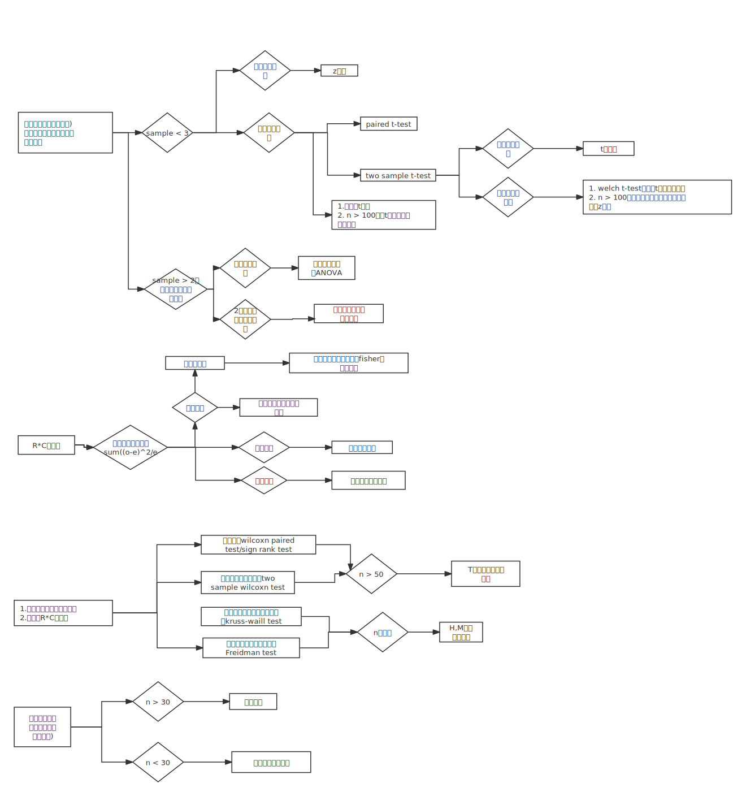

```{r setup, include = FALSE}
knitr::opts_chunk$set(
  collapse = TRUE,
  comment = "#>",
  echo = FALSE,
  message = FALSE,
  warning = FALSE,
  cache = TRUE
)
```

```{css}
body {
  font-size:16px;
  font-family: Palatino, palatino linotype, palatino lt std, latin modern roman, source-han-serif-sc, 'Noto Serif SC', 'source han serif sc', 'source han serif cn', 'source han serif tc', 'source han serif tw', 'source han serif', 'noto serif cjk sc', songti sc, microsoft yahei, serif
}

blockquote {
  font-size: 14px;
}

code {
  font-family: Consolas, Courier, courier new, stkaiti, kaiti, simkai, monospace
}

pre,
code {
  font-size: .95em
}
```


# 统计描述

  首先了解数据的频数分布，选用合适的集中以及离散趋势描述数据。

## 数值变量

频数分布图形： range / n 取整数。

- 正态分布数据选用算术均值，方差/标准差/变异系数描述其分布。 
   
  理论公式：  
  计算公式：

> 标准差，变异系数是同单位的。变异系数用于不同尺度，均值相差较大的数据。
> 方差/标准差/变异系数的计算都依赖于均值的计算。

- 对数正态分布数据选用几何均值，全距/四分位数。  
  
  理论公式：  
  计算公式：
- 任意其它分布选用中位数，全距/四分位数

## 分类变量

  分类变量数据主要依赖于各种相对数描述，包括proportion, rate, ration.其中rate主要涉及到时间的概念。

> 数据的标准化法
> 直接化法，按总人口统一人口数。
> 间接法， 每组死亡人数与预期死亡人数之比互相比较。
>
> 动态数列
> 定基/环比，变化/增长（-1），平均发展速度，平均变化速度。

# 正态总体均值的置信区间以及假设检验


**定理一** 设$X_1, X_2, ..., X_n$是来自正态总体$N(\mu, \sigma^2)$的样本，$\bar{X}$是样本均值，则有：

$$
\bar{X} \sim N(\mu, \sigma^2/n).
$$

**定理二** 设$X_1, X_2, ..., X_n$是来自正态总体$N(\mu, \sigma^2)$的样本， $\bar{X}, S^2$分别是样本均值和样本方差，则有

1.
$$
\frac{(n-1)S^2}{\sigma^2} \sim \chi^2_{(n-1)}.
$$

2. $\bar{X}$与$S^2$相互独立。

**定理三** 设$X_1, X_2, ..., X_n$是来自正态总体$N(\mu, \sigma^2)$的样本， $\bar{X}, S^2$分别是样本均值和样本方差，则有

$$
\frac{\bar{X} - \mu}{S/\sqrt{n}} \sim t(n-1).
$$

**证**  由定理一，定理二

  $$\bar{X} \sim N(\mu, \sigma^2/n), \frac{(n-1)S^2}{\sigma^2} \sim \chi^2_{(n-1)},$$

且两者独立，由$t$分布定义知

  $$
  \frac{\bar{X} - \mu}{\sigma / \sqrt{n}} \Bigg/ \sqrt{\frac{(n-1)S^2}{\sigma^2(n-1)}} \sim t(n-1).
  $$

化简上式左边，即得**定理三**。

**定理四** 设$X_1, X_2, ...,X_{n}$与$Y_1, Y_2, ..., Y_n$分别是来自正态总体$N(\mu_1, \sigma_1^2)$和$N(\mu_1, \sigma_2^2)$的样本，且这两个样本相互独立。设$\bar{X}, \bar{Y}$分别是这两个样本的样本均值；$S_1^2, S_2^2$分别是这两个样本的样本方差，则有

1. $\frac{S_1^2 / S_2^2}{\sigma_1 / \sigma_2} \sim F(n_1 - 1, n_2 - 1);$
2. 当$\sigma_1^2 = \sigma_2^2 = \sigma^2$时，
  
  $$
  \frac{(\bar{X} - \bar{Y}) - (\mu_1 - \mu_2)}{S_w\sqrt{\frac{1}{n_1} + \frac{1}{n_2}}},
  $$

其中 $S_w = \frac{(n_1 - 1)S_1^2 + (n_2 - 1)S_2^2}{n_1 + n_2 - 2}, S_w = \sqrt{S_w^2}.$
   
## 小于等于2个样本的情况

### 单样本 - 样本均值总体均值的比较。

**理论公式**

$$
\frac{\bar{X} - \mu}{\sigma/\sqrt{n}} \sim N(0, 1).
$$

当总体为正态变量或依赖于中心极限定理时（CLT)，该公式成立。

> 中心极限定理描述了在大样本情况下样本均值服从于正态分布这一事实。

**$\sigma$未知时**

$$
\frac{\bar{X} - \mu}{S/\sqrt{n}} \sim t(n-1).
$$

当$n \rightarrow \infty$, $t$分布近似于正态分布，计算时可用$z$分布替代$t$分布。

### 配对样本均值比较

$$
t(\upsilon) = \frac{\mid\bar{d} - 0 \mid}{S_\bar{d}} = \frac{\bar{d}}{S_\bar{d}}, \upsilon = 对子数 - 1.
$$

### 两独立样本比较

**理论公式**

 $$
  \frac{(\bar{X} - \bar{Y}) - (\mu_1 - \mu_2)}{\sqrt{(\frac{\sigma_1^2}{n_1} + \frac{\sigma_2^2}{n_2})}} \sim N(0, 1).
 $$

**样本数$n$足够大$(n_1 > 100, n_2 > 100)$**

1. 此时$s_1^2 \approx \sigma_1^2, s_2^2 \approx \sigma_2^2.$

2. 
  
  $$
  Z = \frac{\mid \bar{X_1} - \bar{X_2} \mid}{S_{\bar{X_1} - \bar{X_2}}}, S_{\bar{X_1} - \bar{X_2}} = \sqrt{S_1^2/n_1 + S_2^2/n_2}.
  $$

**方差齐$\sigma_1 = \sigma_2$**

$$
t = \frac{\mid \bar{X_1} - \bar{X_2} \mid}{S_{\bar{X_1} - \bar{X_2}}}, \upsilon = n_1 + n_2 - 2.
$$

式中两样本均数之差的标准误：$S_{\bar{X_1} - \bar{X_2}} = \sqrt{S_c^2(\frac{1}{n_1} + \frac{2}{n_2})}.$

其中合并标准差的平方： $S_c^2 = \frac{S_1^2(n_1 - 1) + S_2^2(n_2 - 1)}{n_1 + n_2 - 2}$


**方差不齐**

$$
t^\prime = \frac{\bar{X_1} - \bar{X_2}}{\sqrt{\frac{S_1^2}{n_1} + \frac{S_2^2}{n_2}}}
$$

通过Satterhwaite法，对自由度进行校正

$$
\upsilon = \frac{(S_{\bar{X_1}}^2  + S_{\bar{X_2}}^2)^2}{\frac{S_{\bar{X_1}}^4}{n1 - 1} + \frac{S_{\bar{X_2}}^4}{n_2 - 1}}
$$

## 大于等于3个样本的情况

**单因素方差分分析(one way ANOVA)**

$$
F = \frac{MS_{组间}}{MS_{组内}} = \frac{SS_{组间}/\upsilon_{组间}}{SS_{组内}/
\upsilon_{组内}}
$$

**随机区组设计地方差分析**

>分组以后再进行随机化，分组地原因在于不同地组别特征对于观测指标有影响。实际上这里有两个因素对观测结果有影响，所以方差分析时也有两个假设。

# 二项分布以及泊松分布总体的假设检验

**二项分布**

$$
S_p = \sqrt{p(1-p)/n}
$$

**泊松分布**

**$\lambda_0 > 20$**

$$
 Z = \frac{X - \lambda_0}{\sqrt{\lambda_0}}
$$

# R*C列联表的卡方检验

**理论公式**

$$
\chi^2 = \sum\frac{(O - E)^2}{E}
$$

**四格表，构成比检验，关联性（独立性）检验的计算公式**

$$
\chi^2 = n(\sum\frac{O^2}{n_{r}n_{c}} - 1)
$$

> 卡方分布是正态总体的一种为连续性的变量，四格表资料的卡方值为不连续的值。
> 当四格表中有小于5的期望值时，进行Yate 的连续性校正公式
> $$
>\chi^2 = \sum\frac{(\mid O - E \mid - 0.2)^2}{E}
> $$
> 若$n \le 40$ 则采用Fisher确切概率法。

**配对设计四格表的计算公式**

$$
\chi^2 = \frac{(b- c)^2}{b + c}, \upsilon = 1
$$

当 $b + c \le 40$ 时， 采用校正公式

$$
\chi^2 = \frac{(\mid b - c \mid - 1)^2}{b + c}, \upsilon = 1
$$

**卡方拟合优度检验的计算公式**

$$
\chi^2 = \sum\frac{(O - E)^2}{E}
$$

# 秩和检验

用于总体分布未知的数值变量以及有序的R*C列联表的检验。

## 数值变量配对检验

**$n \le 50$** 查表

**$n \ge 50$** 正态近似

$$
Z = \frac{\mid T - n(n + 1)/4  \mid - 0.5}{\sqrt{n(n+1)(2n+1)/24 - \frac{\sum(t_j^3 - t_j)}{48}}}
$$


当相同差值数较多时（不包括差值为0的值)，校正式

$$
Z = \frac{\mid T - n(n + 1)/4  \mid - 0.5}{\sqrt{n(n+1)(2n+1)/24}}
$$

其中$t_j$是第$j$个相同差值的个数。


## 两个样本的检验

**$n \le 50$** 查表。

**$n_1$或$n_2 - n_1$超出表的范围**正态近似

$$
Z = \frac{\mid T - n_1(N+1)/2 \mid - 0.5}{n_{1}n_{2}(N+1)/12}
$$

相同秩次过多时，采用校正式。

$$
Z_c = Z\sqrt{C},
$$

其中$C = 1 - \sum(t_j^3 - t_j) / (N^3 - N).$

## 大于两个样本的检验

**单向有序分类变量多个变量或者多个数值变量的检验**

$$
H =\frac{12}{N(N + 1)}(\sum\frac{R_i^2}{n_i}) - 3(N+1).
$$

相同秩次过多时，采用校正式

$$
H_c = H/C,
$$

其中$C = 1 - \sum(t_j^3 - t_j) / (N^3 - N).$

**随机区组的Friedman秩和检验**

$$
M = \frac{\sum_{j=1}^{a}n(\bar{R}_j - \bar{R})^2}{\sum_{j=1}^{a}\sum_{i=1}^{n}(R_{ij} - \bar{R})^2 / n(a-1)}
$$

当相同秩过多时可以进行校正，校正系数为

$$
C = 1 - \sum_{j=1}^{a}\sum_{p=1}^{l_i}(t_{jp}^3 - t_{jp})/[na(a^2 -1 )]
$$

$$
M_c = M/C
$$

# 总结

```{r}

```